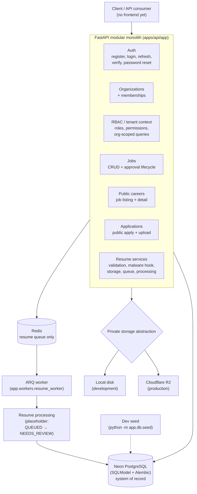

# HireFlow Week 1 Architecture

Backend/API-first milestone. Documents **only what is implemented**; product
direction beyond this lives in [HireFlow_PRD.md](../../HireFlow_PRD.md).

## Component diagram

Supporting pieces (same repo, off the request path): pytest/Ruff/MyPy gates,
`GET /health` (liveness) and `GET /ready` (Postgres + Redis reachability),
PRD error envelope with request IDs, Docker image + Compose (`api`, `worker`,
`redis`; no local Postgres container).

## Request flows

**Public application** (unauthenticated): `POST /api/v1/{orgSlug}/jobs/{jobSlug}/apply`
with multipart `payload` JSON + `resume` PDF → validate file → malware-scan hook →
create candidate + application + `ResumeDocument(QUEUED)` in one transaction →
upload bytes to private storage → enqueue `resume-processing:{org}:{resume}` →
`201 {"message": "Application received"}`. Queue failure keeps the records and
returns 503 so the resume can be re-queued.

**Authenticated job lifecycle**: Bearer JWT → verified-email gate → org context
from membership (never client input) → permission check → scoped query.
Draft → submit → approve → publish → public; invalid transitions are 409, foreign
tenants 404.

**Resume worker**: ARQ pops `process_resume`, re-scopes by `(organization_id,
resume_document_id)`, runs the guarded state machine with exponential-backoff
retries for transient failures. Current processor is a placeholder returning
`NEEDS_REVIEW`; no PDF parsing or AI exists yet.

## Data and tenancy

Every tenant-owned row carries `organization_id`; unique constraints that matter
for idempotency: `(organization_id, slug)` on jobs, `(organization_id, email)`
on candidates, `(organization_id, candidate_id, job_id)` on applications, global
`slug` on organizations, unique `storage_key` on resumes. Resume objects live at
`org/{org}/candidates/{candidate}/resumes/{resume}/original.pdf`.

## Explicitly out of scope

React, LangGraph, Groq, Resend/email delivery, search, interviews, scorecards,
offers, notifications, analytics, SSE, CI/CD, Sentry, rate limiting, security
headers, live provider deployment.
